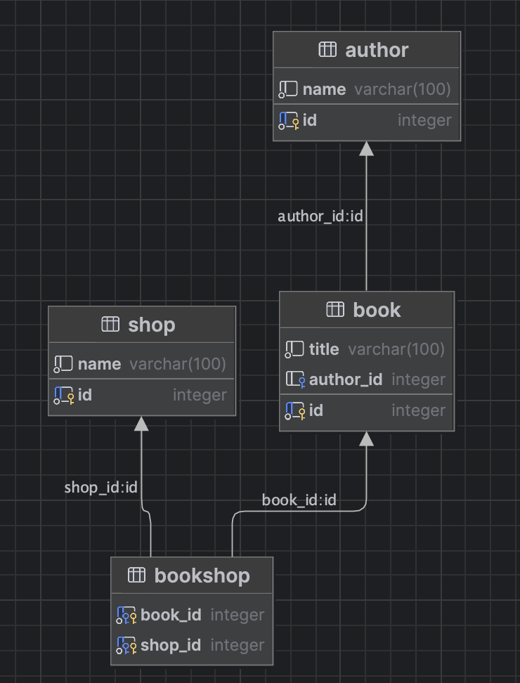

# README

# REST сервис с использованием JDBC & Servlet

---

## Описание

- CRUD приложение
- Сущности: Author, Book, Shop

---

## База данных

`postgres:13.3` - используемая версия

Для запуска `docker-compose up`

---

## Тестирование

При тестировании использовалось:

- JUnit 5
- Mockito
- Testcontainers